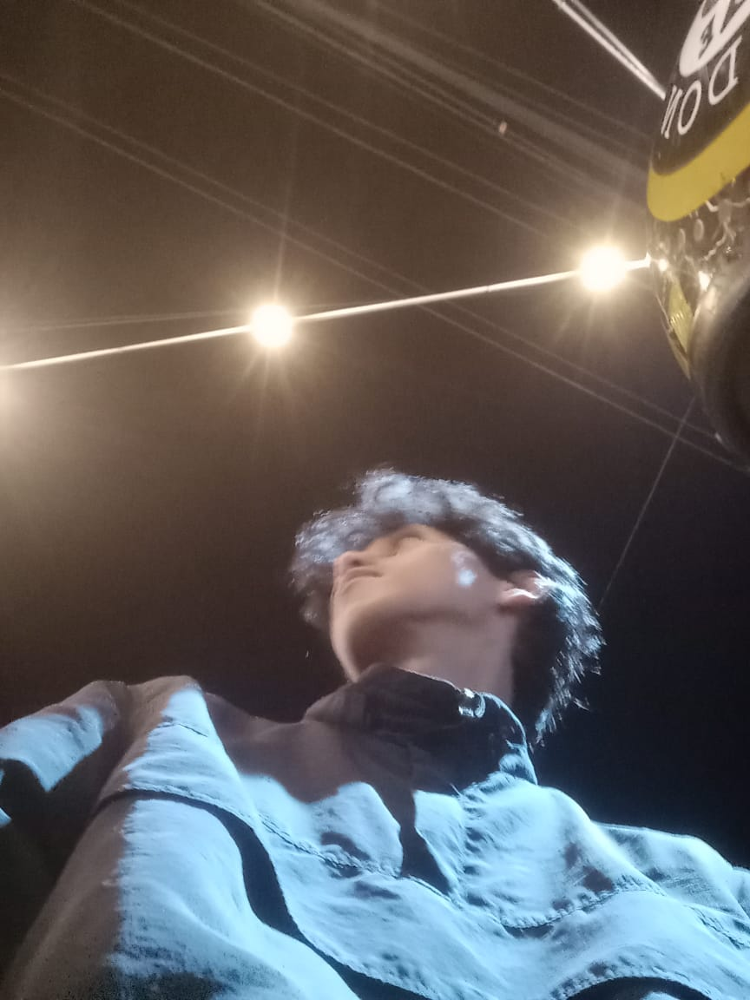
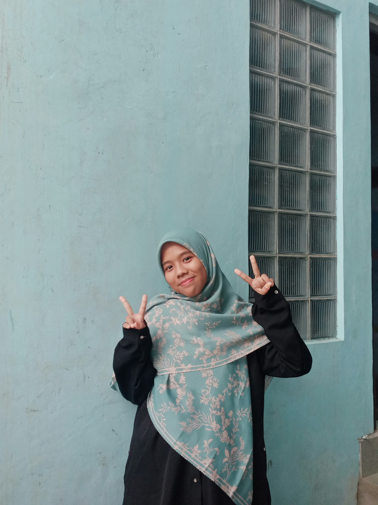

### Hey Guys 
# Tugas UAS Sistem Pakar

Tugas uas sistem pakar dengan judul "Sistem Pakar diagnosa penyakit pada tanaman semangka menggunakan CNN berbasis android"

## Tech and Language 

## Our Team 🌱

  <figure style="margin-bottom: 20px; text-align: center;">
    
  </figure>
  
  <figure style="margin-right: 20px; text-align: center;">
    
  </figure>
  
  <figure style="text-align: center;">
    
  </figure>

## *📫 Reach me*

##
🚀 From [sazara](https://github.com/fay23-dam)
